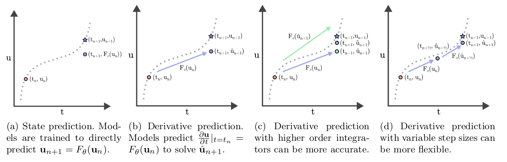

# Predicting Change, not States: An Alternate Framework for Neural PDE Surrogates 
Official implementation of Predicting Change, not States: An Alternate Framework for Neural PDE Surrogates. [(CMAME Paper)](https://www.sciencedirect.com/science/article/pii/S0045782525002622) [(Arxiv Preprint)](https://arxiv.org/abs/2412.13074) 





## Requirements
To install dependencies:
```
conda install pytorch torchvision torchaudio pytorch-cuda=11.8 -c pytorch -c nvidia
conda install lightning -c conda-forge
pip install wandb h5py einops matplotlib
```

The PDE-Refiner baseline has extra dependencies:
```
conda install -c conda-forge diffusers
```

## Datasets
Full datasets are available [here.](https://huggingface.co/datasets/ayz2/temporal_pdes)

Data is organized as: 
```
- Split [train/valid]
    - u : nodal values of the PDE solution, in shape [num_samples, temporal_resolution, spatial_resolution]
    - x : coordinates of the spatial domain, in shape [spatial_resolution]
    - t : timesteps of the PDE solution, in shape [temporal_resolution]
    - coefficients [alpha, beta, gamma, etc.]: coefficients of the solved PDE solution, in shape [num_samples, coord_dim]
```

Advection and Heat data are generated from [Masked Autoencoder are PDE Learners](https://github.com/anthonyzhou-1/mae-pdes), and KS data are generated from [Lie Point Symmetry Data Augmentation for Neural PDE Solvers](https://github.com/brandstetter-johannes/LPSDA). 

Burgers data are generated from [Masked Autoencoder are PDE Learners](https://github.com/anthonyzhou-1/mae-pdes), and NS data are generated from Fourier Neural Operator for Parametric Partial Differential Equations (repo no longer exists).

## Training
Train script will expect a logging directory, paths to the dataset, and a WandB instance.

To train a baseline:
```
python train.py --config=configs/base/[adv/heat/ks/burgers/ns_2d].yaml
```

To train a baseline with the pushforward trick/unrolled training:
```
python train.py --config=configs/pushforward/[adv/heat/ks/burgers/ns_2d].yaml
```

To train a baseline with PDE Refiner:
```
python train.py --config=configs/refiner/[adv/heat/ks/burgers/ns_2d].yaml
```

To train a baseline with 4x params:
```
python train.py --config=configs/params/[adv/heat/ks/burgers/ns_2d].yaml
```

To train a model with $u_t$-prediction (supports different ODE integrators/FD schemes for training targets):
```
python train.py --config=configs/numerical/[adv/heat/ks/burgers/ns_2d].yaml
```

To train a model on higher-res data:
```
python train.py --config=configs/modifications/[adv_data/ns_2d_data].yaml
```

To train a model with more steps during inference:
```
python train.py --config=configs/modifications/[adv_substep/ns_2d_substep].yaml
```
