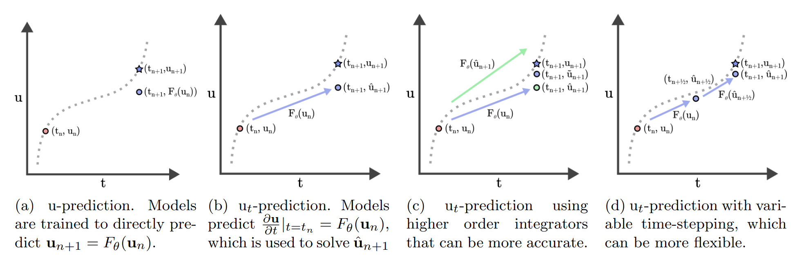

# Framing Neural Surrogates as Temporal Derivative Approximators
Official implementation of Framing Neural Surrogates as Temporal Derivative Approximators. [(Paper)]()





## Requirements
To install dependencies:
```
conda install pytorch torchvision torchaudio pytorch-cuda=11.8 -c pytorch -c nvidia
conda install lightning -c conda-forge
pip install wandb h5py einops matplotlib
```

The PDE-Refiner baseline has extra dependencies:
```
conda install -c conda-forge diffusers
```

## Datasets
Full datasets are available [here.]()

Data is organized as: 
```
- Split [train/valid]
    - u : nodal values of the PDE solution, in shape [num_samples, temporal_resolution, spatial_resolution]
    - x : coordinates of the spatial domain, in shape [spatial_resolution]
    - t : timesteps of the PDE solution, in shape [temporal_resolution]
    - coefficients [alpha, beta, gamma, etc.]: coefficients of the solved PDE solution, in shape [num_samples, coord_dim]
```

## Training
Train script will expect a logging directory, paths to the dataset, and a WandB instance.

To train a baseline:
```
python train.py --config=configs/base/[adv/heat/ks/burgers/ns_2d].yaml
```

To train a baseline with the pushforward trick/unrolled training:
```
python train.py --config=configs/pushforward/[adv/heat/ks/burgers/ns_2d].yaml
```

To train a baseline with PDE Refiner:
```
python train.py --config=configs/refiner/[adv/heat/ks/burgers/ns_2d].yaml
```

To train a baseline with 4x params:
```
python train.py --config=configs/params/[adv/heat/ks/burgers/ns_2d].yaml
```

To train a model with $u_t$-prediction (supports different ODE integrators/FD schemes for training targets):
```
python train.py --config=configs/numerical/[adv/heat/ks/burgers/ns_2d].yaml
```

To train a model on higher-res data:
```
python train.py --config=configs/modifications/[adv_data/ns_2d_data].yaml
```

To train a model with more steps during inference:
```
python train.py --config=configs/modifications/[adv_substep/ns_2d_substep].yaml
```